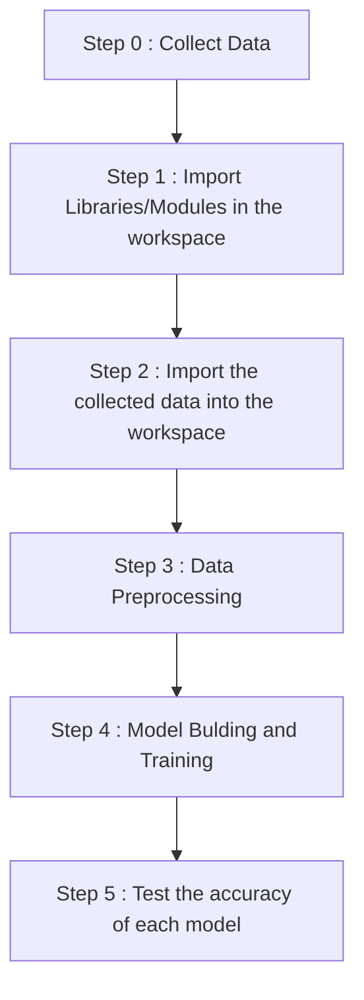

# SMS-Spam-Classifier-NLP-Project

This is SMS classifier ml project which test the performance of different classification models available and finally concludes with the most suitable model to build a support vector classifier.

